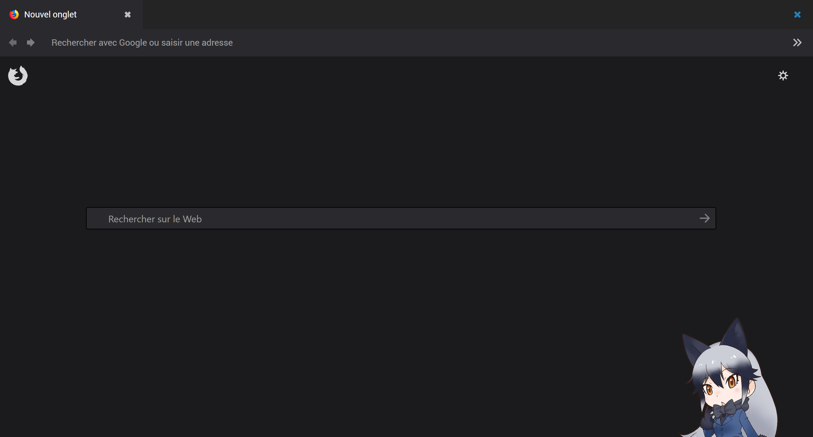
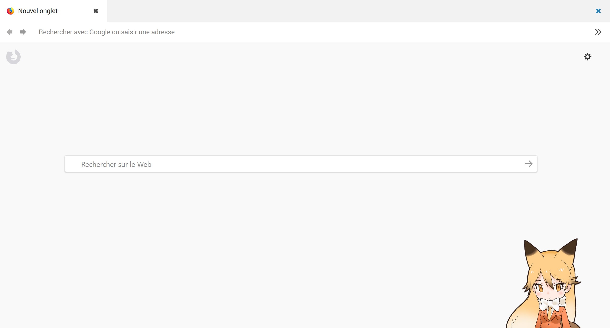

# Melbourne

Preview of <i>Melbourne</i> (dark version).

Preview of <i>Melbourne</i> (light version).

:pushpin: The close button in the titlebar is only compatible with windows 10. The default min, max and close buttons will be visible in windows 7 and 8.

About
-------------------------------

<i>Melbourne</i> is a userchrome for </i>Firefox Mozilla</i>.

UserChrome are CSS file that can be used to change the way Mozilla applications' interfaces look. 

Instruction
-------------------------------

<strong>Step 1 : Create the file userChrome</strong>
<ol>
<li>Create a file called <i>userchrome</i> and make sure that the extension is <i>.css</i></li>
<li>Copy/paste the code and save.</li>
</ol>

<strong>Step 2 : Create the file userContent </strong>
<ol>
<li>Create a file called <i>userContent</i> and make sure that the extension is <i>.css</i></li>
<li>Copy/paste the code and save.</li>
</ol>

<strong>Step 3 : Specific directory </strong>
<ol>
<li> Go to C:\Users\[NAME]\AppData\Roaming\Mozilla\Firefox\Profiles\[SOMETHING].default"</li>
<li> Create a new folder and name it <i>chrome</i>.</li>
<li> Move the files in the said folder.</li>
</ol>

<strong>Step 4 : Install the font </strong>

I use several fonts for my userchrome.
<ol>
<li> <a href="http://www.freejapanesefont.com/bokutachi-gothic-2-bold/">Bokutachi no Gothic 2 </a></li>
<li> <a href="https://www.fontsquirrel.com/fonts/roboto">Roboto</a></li>
</ol>

<strong>Step 5 : Show your appreciation </strong>
<ol>
<li>Feel free to comment this submission (critique, suggestion, compliment, etc).</li>
<li>If you like my works, don't hesitate to watch me.</li>
<li>You can share it, but don't forget to mention me.</li>
</ol>

Report
-------------------------------

Don't hesitate to report any issues you find while using this userchrome.
